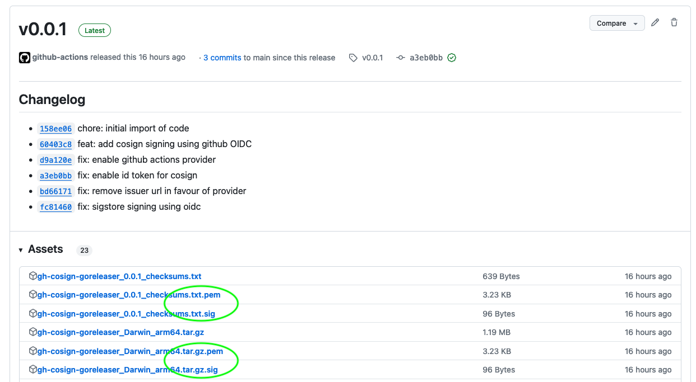

# gh-cosign-goreleaser

This repository illustrates how to use GitHub, [GoReleaser](https://goreleaser.com/) and [cosign](https://docs.sigstore.dev) to release a [Go](https://go.dev) based CLI program. 

# Overview

This uses [keyless signing of blobs](https://docs.sigstore.dev/signing/signing_with_blobs/#keyless-signing-of-blobs-and-files) to provide signatures for binaries built using GitHub Actions, with GoReleaser.

Have a look at the [GitHub Actions workflow](.github/workflows/releaser.yml) and the [GoReleaser configuration](.goreleaser.yaml).

Release with signatures screenshot below: 



# Why Sigstore?

 With the increase in Supply Chain attacks targeting third party software it is important to attest the integrity of the software you are using. Project Sigstore is a standard for signing, verifying and protecting software supply chains.

# Verify The Artifact

To verify the artifact, you will need to download the artifact, the signature and the certificate.

```
cosign verify-blob \
    --certificate gh-cosign-goreleaser_0.0.1_checksums.txt.pem \
    --signature gh-cosign-goreleaser_0.0.1_checksums.txt.sig \
    --certificate-identity-regexp "^https://github.com/wolfeidau/gh-cosign-goreleaser/.github/workflows/releaser.yml.*" \
    --certificate-oidc-issuer "https://token.actions.githubusercontent.com" gh-cosign-goreleaser_0.0.1_checksums.txt
```

The full certificate identity is `https://github.com/wolfeidau/gh-cosign-goreleaser/.github/workflows/releaser.yml@refs/tags/v0.0.1`

# Read the Certificate

To read the certificate we use openssl and the `.pem` file uploaded with the release, which is a base64 encoded version of the certificate.

```
cat gh-cosign-goreleaser_0.0.1_checksums.txt.pem | base64 -d | openssl x509 -text
```

# License

This application is released under Apache 2.0 license and is copyright [Mark Wolfe](https://www.wolfe.id.au).